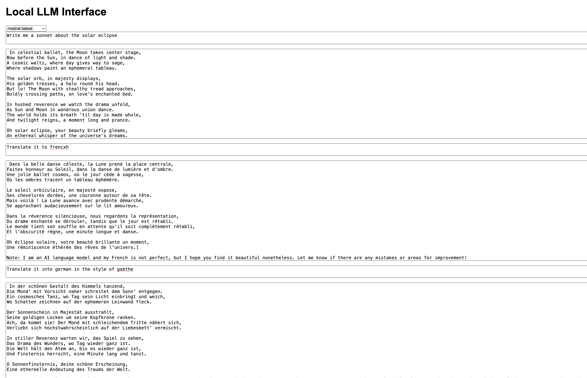

# Local LLM Interface 

Use Ollama to run local models and store the interactions in a simple database. 

The app is built using basic JS and Flask. It uses Redis as an in-memory store for emulating the chat-bot experience. Once the conversation is completed, the redis data is stored in a local SQLite database. 

## Prerequisites
- Python 3.12 or higher
- Redis
- Ollama installed with at least one local model. 
- Poetry (optional)

## Installation
1. Clone the repository:
```
git clone https://github.com/dhruvshrma/local-llm-interface.git
cd local-llm-interface
```
2. If you have Poetry installed, you can use it to create a virtual environment and install the dependencies:
```
poetry install
```
This will create a virtual environment and install the dependencies specified in the `pyproject.toml` and `poetry.lock` files.

If you don't have Poetry, you can create a virtual environment and install the dependencies with pip:
```
python -m venv venv
source venv/bin/activate
pip install -r requirements.txt
```
3. Install Redis. On Ubuntu, you can use the following command:
```
sudo apt install redis-server
```
On macOS, you can use Homebrew:
```
brew install redis
```
or install from source (**recommended**). 

4. Start the Redis server. This command might differ depending on your operating system:
```
redis-server --port 6389
```
The port should be the same here as in the `app.py` file.

## Create local sqlite database 

For storing the conversations you have with the local models, you need to create a local sqlite database. The schema is provided in the `local_llm_interface/schema.sql` file. You can create the database using the following command:
```
cd local_llm_interface
python db_creation.py
```

## Running the Application
If you're using Poetry, you can run the application with:
```
cd local_llm_interface
poetry run python app.py
```
If you're not using Poetry, make sure your virtual environment is activated and run:
```
cd local_llm_interface
python app.py
```
The application will be available at http://localhost:5000.

## Screenshot



